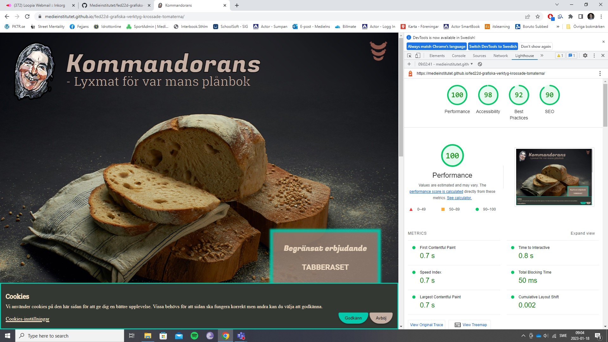
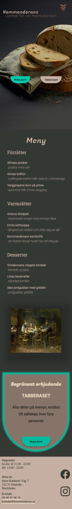
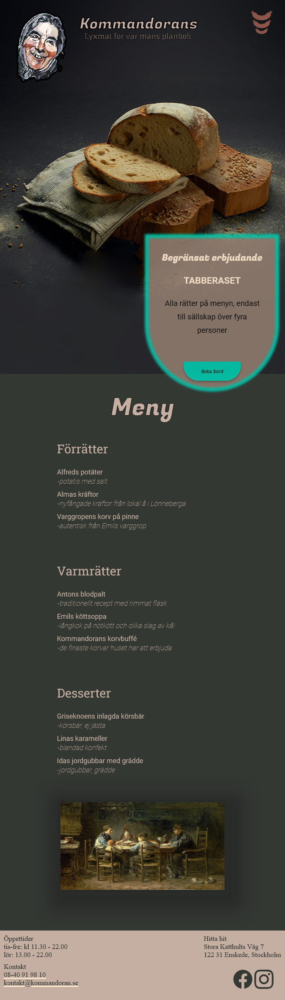
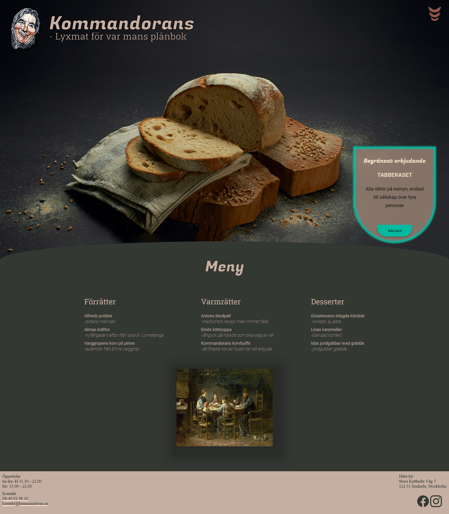

## KOMMANDORANS WEBSITE

School project at Medieinstitutet Front End Developer program.

Designed by [jenmwa](https://github.com/jenmwa), [JoeldelPilar](https://github.com/JoeldelPilar), [arnetzlinder](https://github.com/arnetzlinder) and [@robin-sevelin](https://github.com/@robin-sevelin) 
Coded by [alexwallden](https://github.com/alexwallden), [jeppeerixon](https://github.com/jeppeerixon), [hannaforssell](https://github.com/hannaforssell) and [tittieth](https://github.com/tittieth)

## LINK TO LIVE WEBSITE
https://medieinstitutet.github.io/fed22d-grafiska-verktyg-krossade-tomaterna/

## Tech stack:
     

## LIGHTHOUSE VALIDATION

## LIVE SCREENSHOTS
### Mobile:  
  
### Tablet:  
  
### Desktop:  

